# Spotting A Fake ThinkPad Classic Keyboard

After purchasing a few "genuine" classic keyboards off eBay, particularly for the xx10 and xx20 series (which means, T410, T510, X220, T420, T520, and W520) laptops, I noticed that I keep getting *fakes*, even though all the reviewers seemed to be happy. I am certainly not happy with a fake, I wanted a "genuine" keyboard! What is a fake? It's a copy, a counterfeit, a knock-off, a keyboard which is trying to disguise itself as a genuine, original Lenovo keyboard, which it is *not*.

These keyboards are desirable because they're the last generation of ThinkPads (besides the 25th Anniversary edition) to have a classic-style and the 7-row layout. They're a joy to type on, with a deep, responsive, key press, and the style of the "old way" is arguably better than the look of the new chiclet-style keyboards used since the xx30 series. The added ability to retrofit them into the xx30 series ThinkPads also increases demand for these keyboards, which only adds to the incentive for merchants to sell fakes which can be produced easier and cheaper than it would be to find a genuine one.

This guide will show you how to spot a fake quickly and easily, even if you aren't able to remove the keyboard from the chassis and inspect the bottom. As a quick note on eBay sellers: they will almost *always* use genuine photos in their listings and still send you a fake. Message them before you buy to get it in writing that they're selling a genuine keyboard with the FRU that they're advertising. Chances are, they'll ignore your message and you can safely move on to the next listing.

This guide will also focus on the U.S English keyboards, since that is what I have available. There are 3 FRUs to look out for with the U.S. English layout:

* 45N2071: Alps (white pads)
* 45N2141: Chicony (grey pads)
* 45N2211: NMB (and sometimes LiteON) (red pads)

Each of these have their own characteristics which determine how they feel, but will appear the same on the outside. If you're able to pop a key up, you can tell which manufacturer made the keyboard by the color of the pad (the rubber membrane that gets pressed and depressed when you push a key).

## Genuine Keyboard

Let's start off by looking at a real, genuine Lenovo keyboard pulled from a ThinkPad T410. It has a bit of wear, which is why some of the keys are a little shiny, but its functionality is still perfect. Let's look at a few key areas we'll focus on.

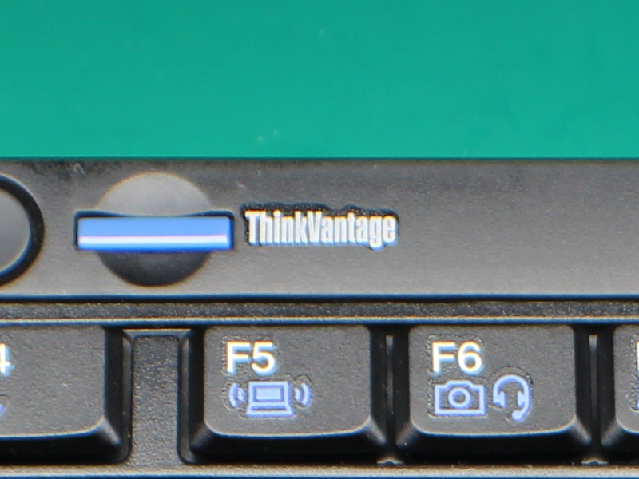

For some reason, fakes always get the "ThinkVantage" label wrong, as we'll see below. This is the easiest way to spot a fake even at a glance. When you've used one of these keyboards for years, you get *very* used to seeing this particular font, thickness, and spacing of the letters. Really look at it, it's perfect. The dot in the "i" is 

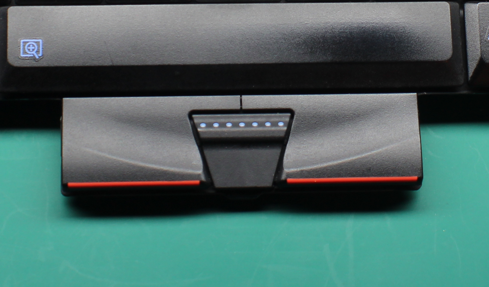

Another component are the buttons that sit below the spacebar and above the palmrest. These may be harder to use as an identifier if you don't have a genuine keyboard around, but it's another one of those things that when you feel a fake, you just know.

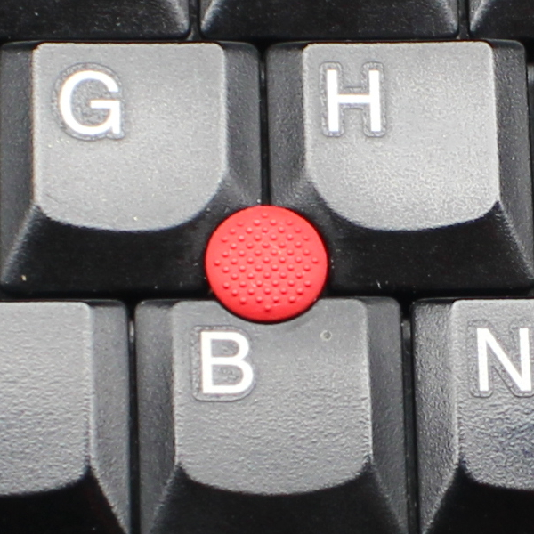

The final component to specifically look for is the TrackPoint (red nub in the middle of the keyboard). Genuine keyboards have a slightly convex shape to them. These parts are replaceable though, and the previous owner could have just put a new one on if the old one were worn out.

The back of the keyboard really shouldn't be that useful for identifying fakes, since stickers *could* easily be printed that appear just like a genuine keyboard. However, we'll see below that the counterfeiters still get this wrong. This is what the back of a genuine Chicony keyboard looks like. We can see that the FRU matches for Chicony above, and the keyboard's own parts number matches across stickers. We also see the iconic "QC" sticker with hand-penned sign-offs.

## Fake #1

Now let's take a look at our first fake ThinkPad keyboard. This one was sold to me as a "Genuine Lenovo" from a *highly* reputable eBay seller that even specializes in supplying parts for ThinkPads.

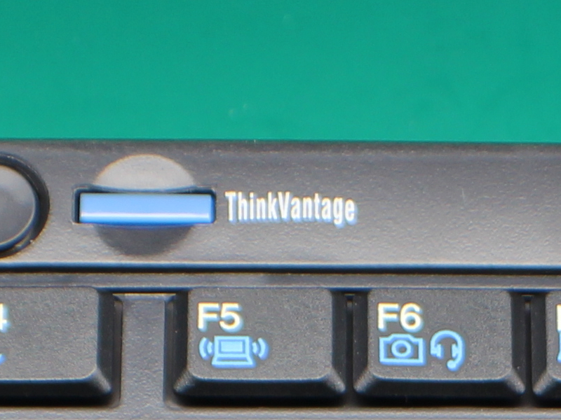

The first thing we notice is the font, spacing, and even the letter-alignment of the "ThinkVantage" label is completely wrong. The "e" is lower than the other letters, and looks horrible. You can also tell in this image that the shade of blue for the function keys is lighter, and more neon-like than the genuine. However, that would be hard to spot without a genuine for side-by-side comparison.

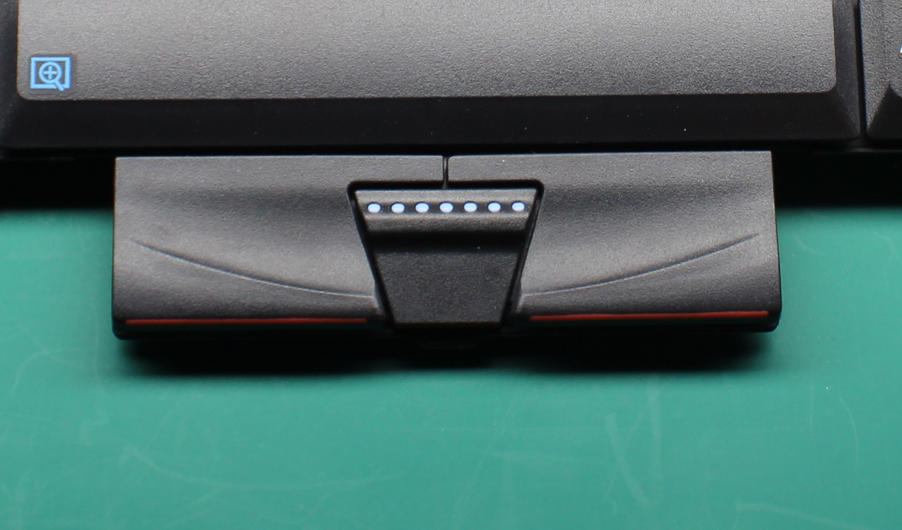

Next, we look at the mouse buttons, which actually appear to be close to the original. The 7 blue dots are *slightly* too large, though.

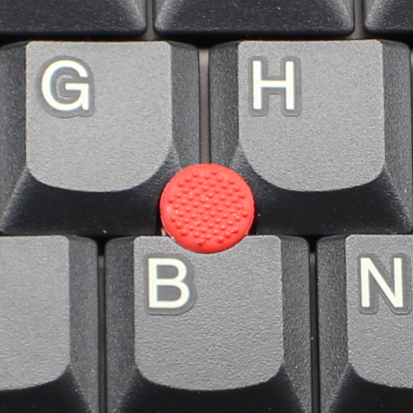

Then we look at the TrackPoint, which is hard to do from a picture, but if you could put your finger on it, you'd be able to tell right away. This TrackPoint is *slightly* recessed, which after years of using a TrackPoint on a genuine keyboard, feel immediately wrong.

The back-side of this fake is almost laughably wrong, and remember, this one was from a very popular ThinkPad-specific eBay seller! To begin, none of the OEM manufacturers put a QR code on the back of their keyboards at the time. The other sticker is completely wrong for this (or any) xx10 or xx20 serires keyboard, as Sunrex is not a manufacturer for this generation's keyboards. Additionally, the ribbon that connects to the ThinkPad's motherboard is taped down at the wrong angle, and there is excessive slack in the TrackPoint ribbon.

## Fake #2

The second fake I have isn't from a popular eBay seller, as I was hoping that maybe by using a smaller seller, I would actually get a genuine keyboard this time. This turned out to be wrong.

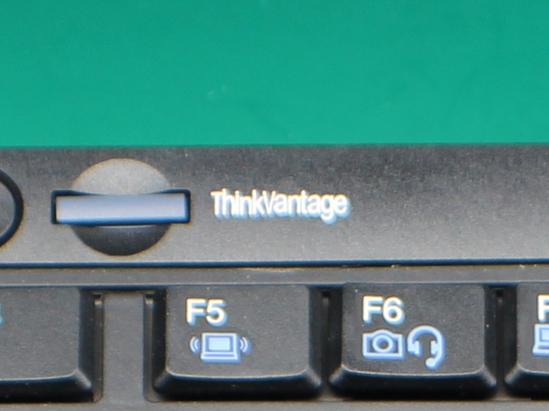

The most obvious tell is the font on the "ThinkVantage" label. It's some generic sans font, which is clearly too thin. If you see a label like this, you don't even need to move on to verifying other components, you know you're dealing with a fake.

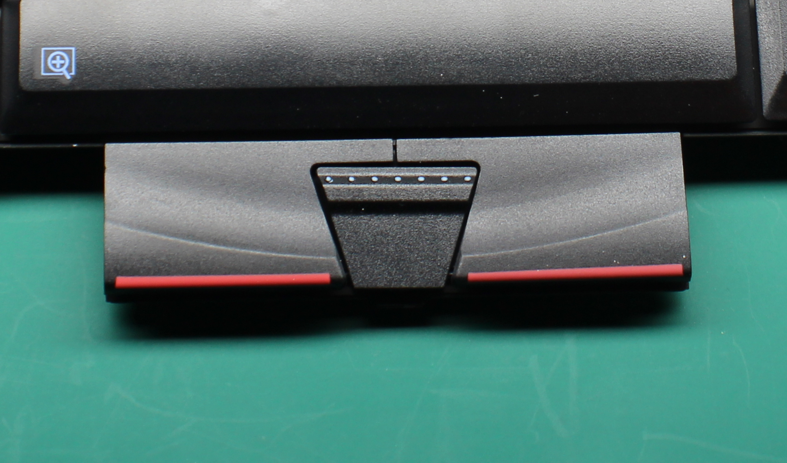

One thing that's impossible to capture in a picture with these buttons is the *feel*, and the buttons on this particular keyboard feel totally off. Visually, we can tell that the 7 blue dots are too small, and the shade of red seems more faded, but this would again be hard to determine without a genuine near by for comparison.

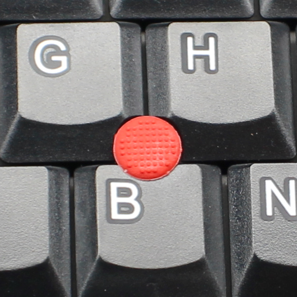

This keyboard's TrackPoint is actually completely flat, which is also wrong, and can also only reliably be detected if you can physically touch the keyboard. Visually an interesting thing to notice is the rows of dots are straight verticle and horizontal, instead of diagonal like on a genuine. Underneath, the TrackPoint connects to a square-shaped peg, so it's impossible to get this wrong unless the TrackPoint itself was manufactured incorrectly.

At first glance of the back, we may think that this looks good. There's the barcode sticker to the left with the parts and FRU numbers and the inspection sticker to the right. Upon further inspection, we'll unveal some issues. First, there's no inspector's markings on the right sticker, very easy to fake, but not present here. Also on the inspector's sticker, no parts number matches the parts number on the barcode sticker. Finally, and the biggest tell that this is a fake is that this is a "LITEON" inspection sticker, while the FRU identifies the keyboard as a Chicony. If this were a LiteON (manufacturing for NMB), the pads of this keyboard would be red.

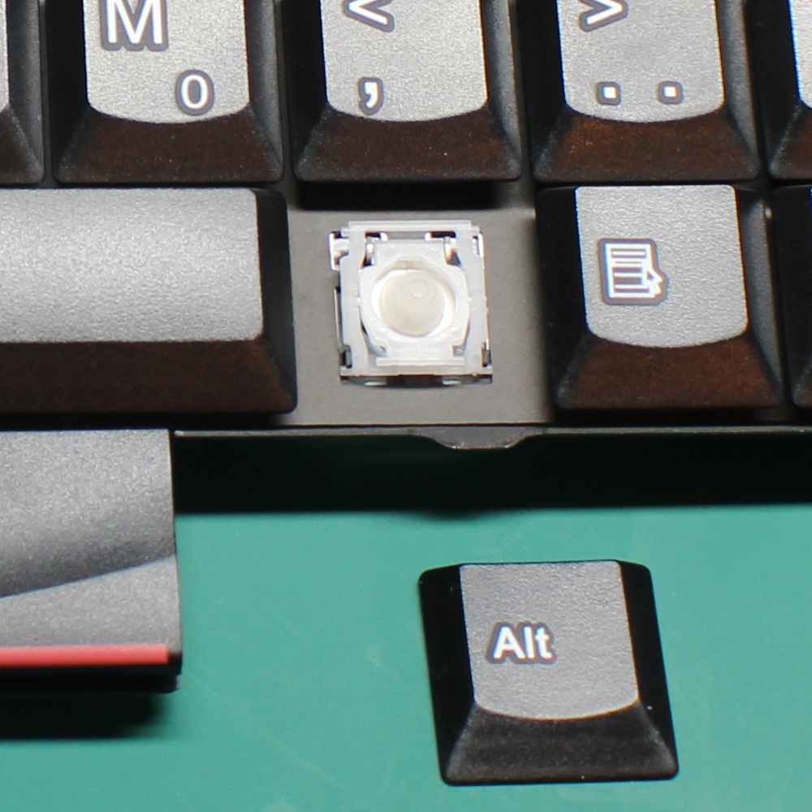

Here we see that the pads are in fact grey, which shows this is not a LiteON (NMB) keyboard at all (not that we didn't know that already).

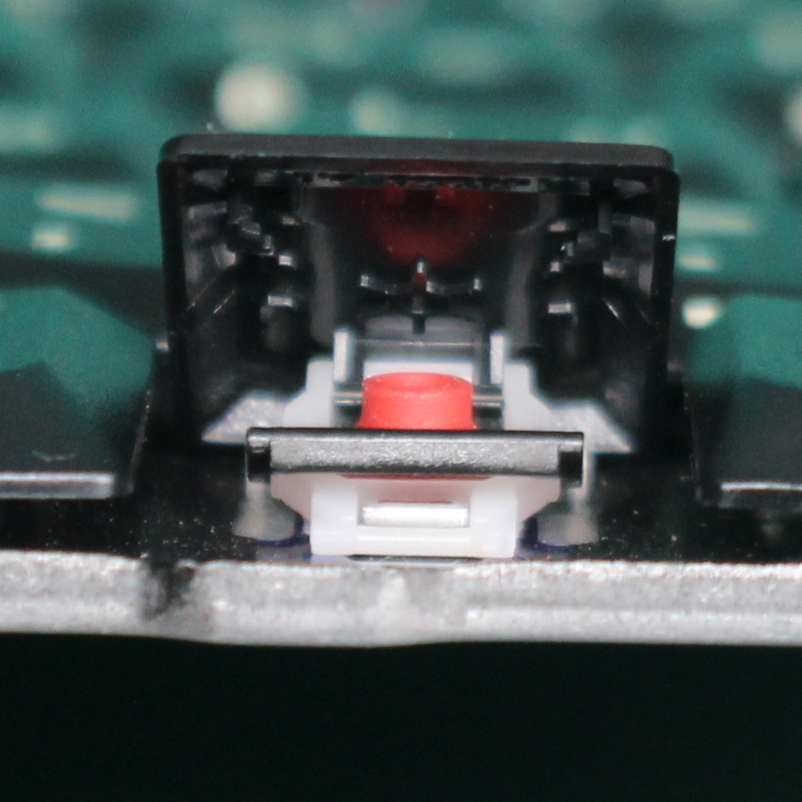

Just for comparison, here we see a genuine LiteON (NMB) pad and key switch that I have in a genuine Japanese layout keyboard (FRU 45N2242).

## Conclusion

If you made it through this, perhaps you're as obsessed with owning genuine Lenovo keyboards on your classic ThinkPads as I am. If you do end up buying a fake from a seller who is listing it as genuine, feel free to point out exactly how you know their product is not genuine, since they will usually already be aware of the different FRUs and will likely point to that as the reasoning.
