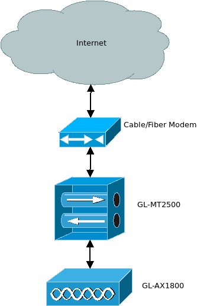
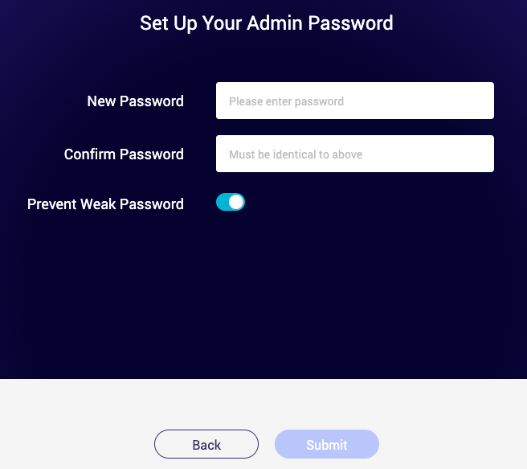
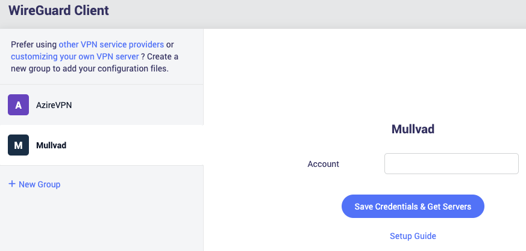
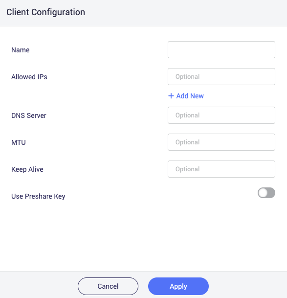
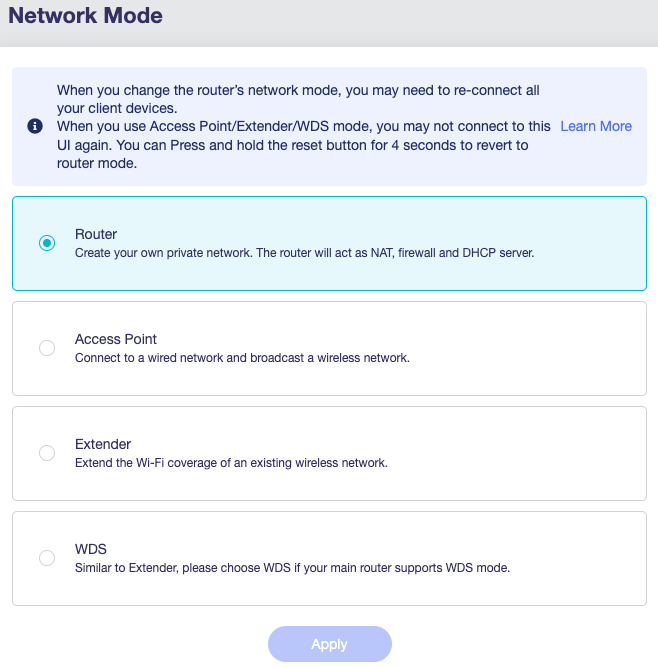

# How to set up a VPN gateway

A VPN gateway allows you to access your home network from outside, like through the internet. This is useful when traveling and you need to access your file server at home, self-hosted applications, or another topic covered in this guide: cascade all your devices through one VPN connection. That enables you to route all of your network's traffic, regardless if it supports a VPN or not, through a VPN service, which is a win for privacy!

No prior networking experience is necessary to set this up, nor will you need to touch a command-line. All you're going to be doing is plugging in a few components, accessing a web-based UI, and connecting devices to WiFi. If you're able to self-custody your own Bitcoin, you can follow this guide.

To start, let's go over the necessary hardware. Naturally, we're only going to use [free software](https://www.gnu.org/philosophy/free-sw.html) because our goal is always to be free. There are plenty of options if you're able to flash a free router OS yourself, be it [OpenWrt](https://openwrt.org/), [pfsense](https://www.pfsense.org/), or similar, you can check compatibility, but that's not part of this guide. However, the easiest way is to use a manufacturer that ships their products which already come with a free software OS.

## [GL.iNet GL-AX1800 Flint](https://www.gl-inet.com/products/gl-ax1800/)

This is a WiFi 6 router that comes pre-installed with OpenWrt. By itself, it supports being a VPN client with [Mullvad](https://mullvad.net), so you could just buy this, enable the VPN client, and all your devices that connect through it would benefit. However, it doesn't support VPN cascading, which is necessary to benefit from using a VPN server *and* client.

Cost: ~$100

## [GL.iNet GL-MT2500](https://www.gl-inet.com/products/gl-mt2500/)

The Brume 2 is a VPN gateway that fulfills our need to have both a VPN server and client, among a few other things we'll set up in this guide. It comes in two designs, one is aluminum and the other is plastic. It doesn't matter which one you buy as they both have the same capabilities.

Cost: ~$60 to ~$90

## Additional Hardware

You'll need at least one extra network cable to be able to connect to these devices for their setup. It's also just handy to have around in case you ever need one. It's also assumed that you have a machine capable of plugging a network cable into it, so make sure your laptop actually has a network (Ethernet) port.

Cost: ~$10

## Network Topology

Here is roughly what the network is going to look like.

At the top, we have the internet, of course. This will cover everything that is not specifically within your network, referred to as a LAN. Under that, we're going to assume you have some sort of cable or fiber modem, depending on your ISP (internet service provider), that gives you access to the internet. Next down the line is the GL-MT2500 (or the MT2500A, if you got the aluminum one) which is our VPN gateway and router. Finally, at the bottom we have the GL-AX1800, which is our wireless access point.

Keep this diagram in mind when we get to plugging everything in.

## Setup the MT2500

The first thing to set up is the MT2500. This is a very simple device with only 2 network ports, and they're clearly labeled: LAN and 2.5G WAN. You'll plug the included network cable into the 2.5G WAN port, then plug the other end of that into any LAN port of your ISP's modem. This will allow the modem to assign the MT2500 an IP address, which we'll need shortly. 

Now plug your laptop into the LAN port of the MT2500. The MT2500 is a router and will assign you a LAN IP address. Its default IP address should be 192.168.8.1, and you can access it by opening up your browser and navigating to http://192.168.8.1 which will greet you with an initial setup page that asks you to enter a device access password.

After this, you'll be presented with the admin panel. The first thing you're going to want to do is update the firmware. Mine came with an outdated version yet the device thought it was at the latest version. Go to "SYSTEM" on the side-panel, then click on "Upgrade". Yours probably thinks its "Firmware is up to date" as well. However, unless the version you see is "4.2.0", it's actually not.

### Upgrading Firmware

Head [over here to this site](https://dl.gl-inet.com/?model=mt2500) to grab the latest firmware image for the MT2500, 4.2.0, as previously noted. You can download it anywhere to your laptop, just be sure you remember where it is. Next, click on "Local Upgrade" in the MT2500's Upgrade page, and select the file. [Here](https://docs.gl-inet.com/en/4/tutorials/firmware_upgrade/#local-upgrade) is the official docs on this process, but it's very simple to do. The MT2500 will verify the file before allowing you to upgrade, and if everything passes, click on "Install". When it completes, the MT2500 will restart and you'll have to enter your device admin password again to get back into the admin panel.

### Enabling The VPN Client

Now that we're on the latest version, we can begin setting up the MT2500 to be both a VPN client and a server. We're going to use WireGuard instead of OpenVPN, since it's easier to set up and faster. Click on "VPN" on the side-bar of the admin panel, then WireGuard Client. We'll use Mullvad in this example, so click on Mullvad and enter your Account Number.

Once you click "Save Credentials & Get Servers" you'll be presented with a list of Mullvad's servers. The choice you make is up to you, [here](https://mullvad.net/en/servers) is a list of Mullvad servers and their capabilities to help you decide, since you'll mainly be connecting to a single server. Once connected, you should verify that the top banner on [Mullvad's](https://mullvad.net) page picks up that you're connected to their VPN, and to the server that you selected, on your laptop.

### Enabling The VPN Server

To [setup the WireGuard server](https://docs.gl-inet.com/en/4/tutorials/wireguard_server/#setup-wireguard-server), you're going to navigate again to "VPN" on the side-panel, then click on "WireGuard Server". Since the server hasn't been initialized yet, there's only one thing to do first, click on "Generate Configuration", then go to "Profiles". You're going to create a profile for your phone to connect.

You'll only need to give it a Name and I also set the DNS Server to 192.168.8.1, which is the VPN gateway's address, since if you leave it blank, it will use an external DNS provider, which leaks info about you. When you click "Apply", you'll be presented with a QR code. On your phone, install the official "WireGuard" application (I noticed the one in F-Droid is outdated) from the Play Store, or whichever privacy-preserving front-end you prefer.

You'll click on the "+" icon at the bottom-right of the WireGuard application when it's opened, and choose "Scan from QR code". I noticed _sometimes_ it doesn't pick up the QR code correctly, saying that there's a configuration property that's unsupported. If this happens, simply scan it again and it'll eventually go through. Once it picks it up, you'll give the connection a name, like "Home", and you'll be able to save it. However, before we can successfully connect, we need to do one more step in your ISP's modem. Before we proceed to that "Start" the WireGuard server, then navigate to the "INTERNET" section on the side-bar and take note of the "IP Address", which is what your ISP modem is assigning you.

### Port Forwarding

This step may be optional for some users, but likely if so, you already know what you're doing anyway. If you're not sure, keep following along. No matter which model your ISP gave you, enabling port forwarding is usually a very straightforward process. [Here's](https://www.att.com/support/article/u-verse-high-speed-internet/KM1215101) and example from a modem that AT&T provides, which isn't one that I have, but the interface was exactly the same. On any device, you'll typically find port forwarding on pages related to "Firewall" or "NAT/Gaming". The only details that you actually need is the port number and the address to forward to.

The address will be that of your MT2500, which you already took note of, and the port is simply "51820", which is the default WireGuard port. Once the configuration on your ISP's modem is saved, you can try connecting to your VPN from your phone. You can unplug from the ISP's modem and plug back into the MT2500 at this point. Navigate to the "VPN Dashboard" within "VPN" on the MT2500's side-bar. Near the bottom, under the "VPN Server" section, you should see "1 Client (1 Online)", and some data being transferred, if everything was successful.

The final test to ensure everything works is to disconnect from any WiFi from your phone, connect to the VPN, and check that [Mullvad.net](https://mullvad.net) sees you're connected.

### Troubleshooting

This is actually the most difficult part of the guide, so let's go over a few things that could prevent you from successfully connecting to your VPN Gateway. First, if the phone simply won't connect from the WireGuard application, the issue is likely either port-forwarding wasn't applied correctly, or the wrong public IP address was detected in the WireGuard configuration.

Either way, log back into your ISP's modem. First, take note of your public IP address. It should be labeled as a "Broadband IP Address" or similar. If you can't find anything like that, you can plug your laptop directly into a LAN port of it, then visit a site like [whatismyipaddress.com](https://whatismyipaddress.com/) to find your public IP address. If your ISP doesn't assign you a public IP address, you can look at enabling [Dynamic DNS](https://docs.gl-inet.com/en/4/tutorials/ddns/) in the MT2500's settings. When you have your public IP address, edit the client configuration on your phone and ensure that it matches what is under "Peer" for "Endpoint", then you'll see ":51820".

If the public IP address is set correctly and you still can't connect, double-check that the port-forwarding saved in the ISP's modem. It should be for port "51820" and forward all requests for that port to the internal IP address assigned to your MT2500. If a range of ports of offered, simply put "51820" for both the beginning and end.

Another common issue is you can connect, but nothing works once connected. Fortunately, the solution to this is simple. Just edit the client configuration on your phone, and change the "MTU" under the "Interface" to 1280 (which is what I used). Then reconnect and everything should work.

## Setup the AX1800

With your VPN gateway setup, now it's time to enable all your devices to connect through the VPN client (Mullvad) that was put on the MT2500. Power on the AX1800, but don't plug it into the MT2500 just yet. Instead, connect a network cable from the AX1800's WAN port to one of your ISP modem's LAN ports. Then, plug your laptop directly into one of the LAN ports of the AX1800, and navigate to [192.168.8.1](http://192.168.8.1) (notice an IP conflict?).

You'll have to go through a similar first-time device setup, assigning an admin password, before you can access the admin interface.

### Upgrading Firmware

Just like the MT2500, the first thing we're going to do is upgrade the AX1800's firmware. Go [here](https://dl.gl-inet.com/?model=ax1800) to find the latest firmware image for the AX1800. One special thing to note here is if you're not on a version 4 of their firmware, you'll need to download their `.img` firmware in order to upgrade, which is the second Download button. You also won't be able to save any settings, not that we've set anything worth saving on this device yet anyway. Once downloaded, go through the same as we did for the MT2500, click on "SYSTEM", then "Upgrade", and "Local Upgrade". The firmware with the `.img` should verify successfully (the `.tar` won't even verify), and proceed with the upgrade. Upon logging back into the device, it's interface should look just like the upgraded MT2500's.

### Set Network Mode

The only thing we need to do to the AX1800 is change its Network Mode to be a simple Access Point instead of a Router. To do this, click on "NETWORK" on the side-bar, then select "Network Mode". Its current setting should be on "Router", simply change that to "Access Point" and click Apply. Don't worry about the message about not being able to access its interface again. When that's finished, unplug the AX1800 from your ISP modem's LAN port and plug it into the LAN port of the MT2500.

### Setup WiFi

At this point, you should be able to access the MT2500 even while plugged into the AX1800 by navigating to [192.168.8.1](http://192.168.8.1). On the "CLIENTS" page, you should see the newly-assigned LAN IP address of the AX1800. Copy that, and put it in your browser's URL bar to be able to access it's interface. From here, you can navigate to "WIRELESS" and set up your 5GHz and 2.4GHz WiFi just like you would with any other WiFi access point. The only difference here is the internal IP is being assigned by the MT2500, which you don't need to worry about.

Since the AX1800 has WiFi 6 support, you can also enable the more secure WPA3 authentication protocol. Just note that if you don't also have WPA2 support, devices which _don't_ support WPA3 won't be able to connect, so the WPA2/WPA3 selection is recommended. Once you have that setup, unplug your laptop from the back of the AX1800 and connect to it via WiFi. Then, verify that [Mullvad.net](https://mullvad.net) detects that you're connected to their VPN service.

## Conclusion

With this setup, you no longer have to worry about downloading the Mullvad client whenever you set up a new machine, and devices that don't even support enabling a VPN connection gain the benefit of having their traffic pass through a VPN. Additionally, you'll be able to access all your LAN devices from your phone, no matter where you are, while still retaining the privacy of using a VPN client. No longer will you have to rely on Tor to connect to your devices at home!

### Alternatives

There is a (free software) program that provides similar functionality enabled by this guide, without configuring anything, but uses a coordination server to manage a mesh network that's created for your devices. It's completely viable to try out Tailscale before pulling the trigger on this guide, especially since it won't cost you anything (but time) for a single user account.

There is another guide written on setting up "[A simple private home network](https://sovrnbitcoiner.com/a-simple-private-home-network/)." Please read that article anyway, as it provides more information about why you would want control over your network, and additional technical information about how to set up those network devices.

